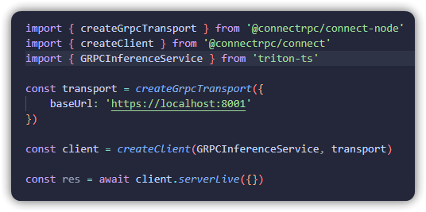

# triton-ts

[](https://www.npmjs.com/package/triton-ts)
[](https://github.com/MrExplode/triton-ts/actions)

[Nvidia Triton](https://docs.nvidia.com/deeplearning/triton-inference-server/user-guide/docs/index.html) server [gRPC client](https://github.com/triton-inference-server/common/tree/main/protobuf) for Node    

<p align="center">
  
</p>
 

## Install
```bash
npm install triton-ts
```

## Usage
This library uses the [buf.build library](https://github.com/bufbuild/protobuf-es) for well typed, modern protobuf handling & code generation.  
Only the generated proto code included, you decide what to do with them. For example, use the [`@connectrpc/connect`](https://github.com/connectrpc/connect-es) library to create a gRPC client.

```bash
npm install @connectrpc/connect
```
Choose a [Connect adapter](https://github.com/connectrpc/connect-es?tab=readme-ov-file#packages) for your target environment, e.g. node:
```bash
npm install @connectrpc/connect-node
```

----
Interact with your Triton instance:  

```typescript
import { createGrpcTransport } from '@connectrpc/connect-node'
import { createClient } from '@connectrpc/connect'
import { GRPCInferenceService } from 'triton-ts'

const transport = createGrpcTransport({
    baseUrl: 'https://localhost:8001'
})

const client = createClient(GRPCInferenceService, transport)

const res = await client.serverLive({})
```


## License
```
MIT License

Copyright (c) 2024 SunStorm

Permission is hereby granted, free of charge, to any person obtaining a copy
of this software and associated documentation files (the "Software"), to deal
in the Software without restriction, including without limitation the rights
to use, copy, modify, merge, publish, distribute, sublicense, and/or sell
copies of the Software, and to permit persons to whom the Software is
furnished to do so, subject to the following conditions:

The above copyright notice and this permission notice shall be included in all
copies or substantial portions of the Software.

THE SOFTWARE IS PROVIDED "AS IS", WITHOUT WARRANTY OF ANY KIND, EXPRESS OR
IMPLIED, INCLUDING BUT NOT LIMITED TO THE WARRANTIES OF MERCHANTABILITY,
FITNESS FOR A PARTICULAR PURPOSE AND NONINFRINGEMENT. IN NO EVENT SHALL THE
AUTHORS OR COPYRIGHT HOLDERS BE LIABLE FOR ANY CLAIM, DAMAGES OR OTHER
LIABILITY, WHETHER IN AN ACTION OF CONTRACT, TORT OR OTHERWISE, ARISING FROM,
OUT OF OR IN CONNECTION WITH THE SOFTWARE OR THE USE OR OTHER DEALINGS IN THE
SOFTWARE.

```
